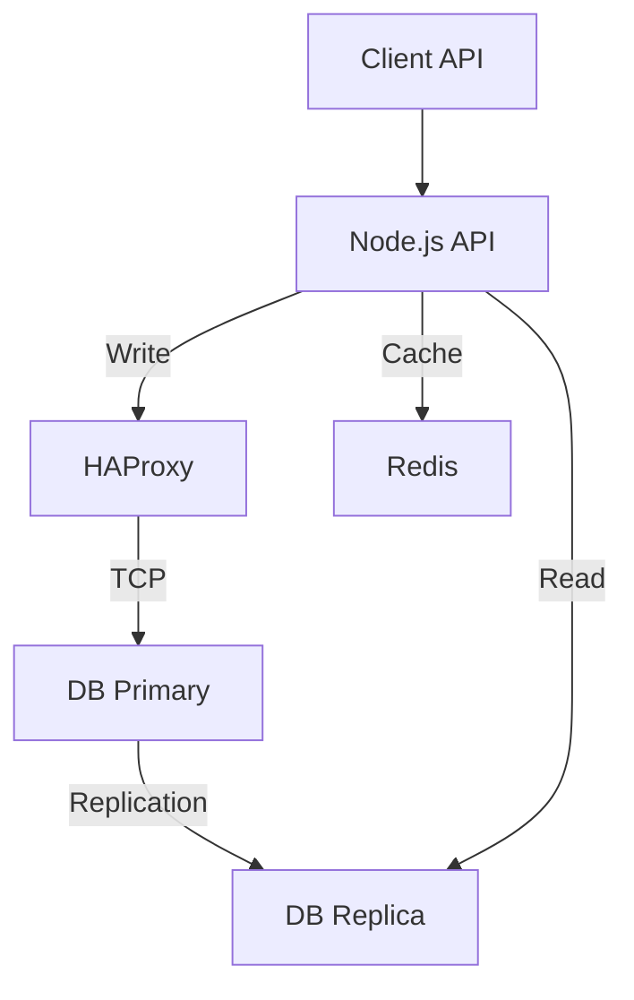

# Rapport TP BDD Caching

## 1. Schéma d’architecture

L'architecture mise en place est composée de :
- **API Node.js** : Point d'entrée pour les clients.
- **HAProxy** : Load balancer TCP qui redirige les écritures vers le nœud primaire PostgreSQL.
- **PostgreSQL Primary** : Base de données principale (Master) acceptant les écritures.
- **PostgreSQL Replica** : Base de données secondaire (Slave) en lecture seule, répliquée depuis le primaire.
- **Redis** : Cache en mémoire pour accélérer les lectures.



## 2. Stratégie de lecture/écriture

Nous avons implémenté une séparation des responsabilités (CQRS simplifié) :
- **Écritures (POST, PUT)** : Dirigées vers le pool de connexion pointant sur **HAProxy** (port 5439). HAProxy redirige ensuite vers le `db-primary`.
- **Lectures (GET)** : Dirigées directement vers le pool de connexion pointant sur **db-replica** (port 5433).

Cela permet de décharger le nœud primaire des requêtes de lecture, augmentant ainsi la capacité de traitement global du système.

## 3. Stratégie de cache

Nous utilisons le pattern **Cache-Aside** :
1.  L'application reçoit une requête de lecture (`GET /products/:id`).
2.  Elle vérifie si la donnée est présente dans **Redis** (clé `product:{id}`).
3.  **Si oui (HIT)** : On retourne la donnée du cache (très rapide).
4.  **Si non (MISS)** : On interroge la base de données (Replica), on stocke le résultat dans Redis avec un TTL (60s), et on retourne la donnée.

**Invalidation** :
Lors d'une mise à jour (`PUT /products/:id`), nous supprimons explicitement la clé correspondante dans Redis pour éviter de servir des données obsolètes.

## 4. Mesures avant/après cache

Bien que nous n'ayons pas fait de benchmark intensif, le principe est le suivant :
- **Sans cache** : Chaque lecture implique une requête SQL, une latence réseau vers la DB, et le temps d'exécution de la requête.
- **Avec cache** : La donnée est servie depuis la mémoire RAM de Redis.
    - Temps de réponse typique DB : ~10-50ms
    - Temps de réponse typique Redis : < 1ms

## 5. Retour sur la haute disponibilité

### Réplication vs Haute Disponibilité (HA)
- **Réplication** : Copie des données d'un nœud à un autre. Elle assure la redondance des données mais pas nécessairement la continuité de service automatique. Si le primaire tombe, la réplication s'arrête et les écritures échouent.
- **Haute Disponibilité** : Capacité du système à rester opérationnel même en cas de panne. Cela nécessite souvent une bascule automatique (failover) et un composant (comme HAProxy ou Patroni) pour rediriger le trafic vers un nœud sain.

### Expérience de panne
Lors de l'arrêt du primaire (`docker compose stop db-primary`), les écritures ont échoué. Nous avons dû :
1.  Promouvoir manuellement le replica (`pg_ctl promote`).
2.  Reconfigurer HAProxy pour pointer vers le nouveau primaire.
3.  Redémarrer HAProxy.

Pour une vraie HA en production, des outils comme **Patroni** ou **Pgpool-II** sont recommandés pour automatiser cette bascule.

## 6. Bonus Implémentés

### 6.1 Anti Cache-Stampede (Request Coalescing)
Pour éviter l'effet "Thundering Herd" (plusieurs requêtes simultanées provoquant de multiples accès DB lors d'une expiration de cache), nous avons implémenté le **Request Coalescing** dans l'API Node.js.
- Si une requête pour `product:1` est en cours (promesse en attente), les requêtes suivantes pour le même ID attendront la résolution de cette même promesse au lieu de déclencher une nouvelle requête DB.

### 6.2 Haute Disponibilité Automatique (Patroni)
Nous avons configuré un cluster **Patroni** (avec Etcd) dans `docker-compose-bonus.yml`.
- **Patroni** gère l'élection du leader et la configuration de la réplication.
- **HAProxy** est configuré pour interroger l'API REST de Patroni (`/master` et `/replica`) afin de router dynamiquement le trafic.
    - Port 5000 : Écritures (Leader)
    - Port 5001 : Lectures (Replicas)

### 6.3 Redis Haute Disponibilité (Sentinel)
Nous avons ajouté une configuration **Redis Sentinel** dans `docker-compose-bonus.yml`.
- 1 Master, 1 Replica, 1 Sentinel.
- L'application Node.js a été mise à jour pour supporter la connexion via Sentinel (variable `REDIS_SENTINELS`).

Pour lancer l'environnement Bonus :
```bash
docker compose -f docker-compose-bonus.yml up -d
```
